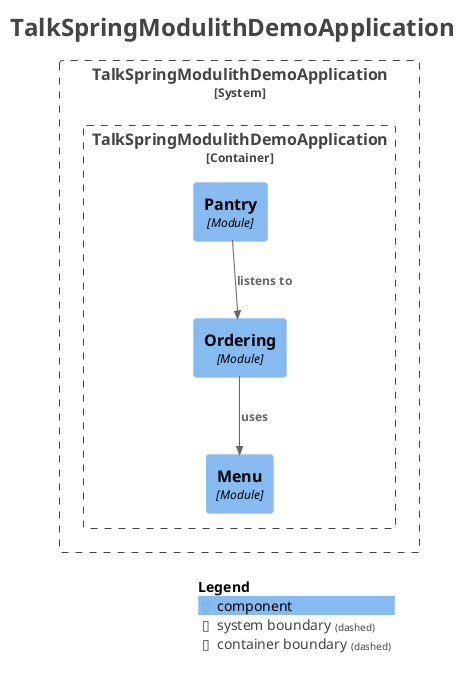
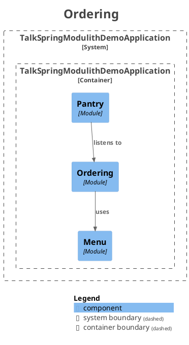
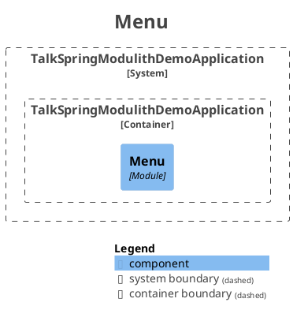
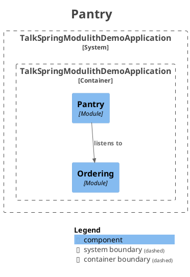

# Spring Modulith Demo

Demo app for the [BrisJVM](https://www.meetup.com/brisjvm/) talk: **Spring Modulith: guardrails for your monolith (and your AI)**.

A coffee recommender. You POST your current state — how long you've been coding, whether everything is on fire, your vibe — and it tells you what to drink. Simple enough to fit in a talk, real enough to show the patterns.

---

## Module structure

```
dev.neilmason.talkspringmodulithdemo
├── ordering          ← REST API. Takes the POST, calls menu, publishes OrderPlaced.
│   └── internal/     ← (none)
├── menu              ← Business logic. Returns a coffee recommendation. Knows about vibes.
│   └── internal/
│       └── RecommendationEngine.java   ← internal, not accessible to other modules
└── pantry            ← Tracks stock. Listens for OrderPlaced. No public API.
    └── internal/
        └── PantryListener.java         ← internal, not accessible to other modules
```

Shared value objects (`OrderRequest`, `CoffeeRecommendation`, `Vibe`) live in the root package — accessible to all modules without creating dependencies between them.

`ordering` → `menu` : direct call (needs an answer back)
`ordering` → `pantry` : via event (doesn't need to know if stock was updated)

---

## Running

```bash
./mvnw spring-boot:run
```

Then POST an order using the pre-saved request in `demo.http` (open in IntelliJ HTTP client), or:

```bash
curl -s -X POST http://localhost:8080/order \
  -H "Content-Type: application/json" \
  -d '{"time":"3am","hoursCoding":6,"onDeadline":true,"vibe":"EVERYTHING_IS_ON_FIRE"}' | jq
```

---

## Module verification + C4 diagram

Run the modularity tests:

```bash
./mvnw test -Dtest=ModularityTests
```

`verifiesModularStructure()` walks every cross-module reference and fails the build if anything reaches into an `internal` package.

`writesDocumentation()` generates C4 component diagrams into `target/spring-modulith-docs/`:

- `components.puml` — full app overview
- `module-ordering.puml`, `module-menu.puml`, `module-pantry.puml` — per-module views

The diagram only generates if the code follows the rules. That's the point.

### Application overview



### Ordering module



### Menu module



### Pantry module



---

## Demo — Sync → Async event handling

`PantryListener` has a `Thread.sleep(2000)` in it to make the async flip visible.

**Sync (starting state — `@EventListener`):**
POST an order. The HTTP response takes 2 seconds. The pantry log appears *before* the response returns — same thread, the handler runs inline.

**Async (change to `@ApplicationModuleListener`):**
POST again. Response is immediate. The pantry log appears 2 seconds *after* the response — different thread, handler runs independently.

One annotation. The publisher (`OrderController`) doesn't change.

---

## Vibes

| Vibe | What it means |
|---|---|
| `FINE` | Everything is fine |
| `STRESSED` | It's getting there |
| `EVERYTHING_IS_ON_FIRE` | It's really getting there |
